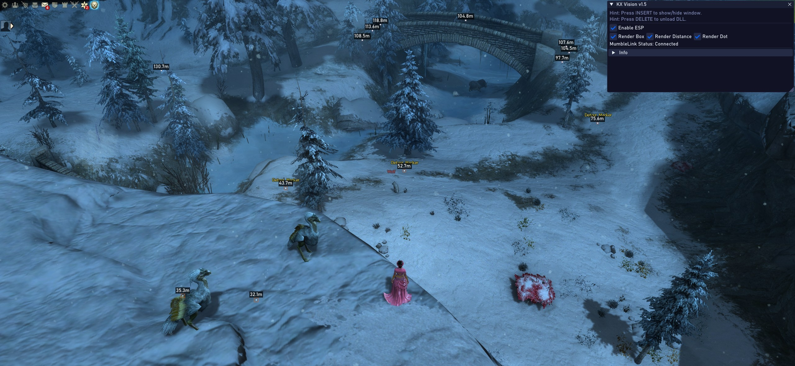

# KX-Vision for Guild Wars 2




[➡️ Download the Latest Release](https://github.com/kxtools/kx-vision/releases/latest)

**Educational Purpose Only:** This project is developed solely for educational purposes, allowing developers to learn about game rendering concepts, memory manipulation, and MumbleLink API integration in Guild Wars 2.

## Overview

KX-Vision is an open-source ESP (Extra Sensory Perception) overlay for Guild Wars 2. It uses the officially supported MumbleLink API for positional data and is designed as a learning platform for real-time overlay rendering with ImGui and DirectX 11, 3D-to-2D projection, and clean C++ architecture for game tools.

## Features

*   **MumbleLink Integration:** Utilizes GW2's MumbleLink API for player and game state data.
*   **Dual-Source ESP:** Renders general agents (e.g., resource nodes) and provides a separate, highly reliable ESP for characters (players, NPCs) by hooking the game's main update loop.
*   **Configurable Visuals:** ESP includes options for boxes, distance, and position dots.
*   **Minimalist UI:** Simple, configurable ImGui interface.
*   **Patch-Resistant Scanning:** Uses pattern scanning to locate necessary game functions, increasing resilience to game updates.

## Building

### Prerequisites

*   **Visual Studio:** 2019 or newer
*   **Windows SDK:** 10.0.19041.0 or newer
*   **C++17 Support**

### Build Instructions

1.  Clone the repository:
    ```bash
    git clone https://github.com/kxtools/kx-vision.git
    cd kx-vision
    ```
2.  Open `KX-Vision.sln` in Visual Studio.
3.  Set the configuration to `Release | x64`.
4.  Build the solution (F7 or Build → Build Solution).
5.  Find the output DLL in the `x64/Release` directory.

## Usage for Educational Purposes

1.  Launch Guild Wars 2.
2.  Inject the DLL using a tool like Process Hacker or Xenos.
3.  Use `INSERT` key to toggle the overlay window.
4.  Configure ESP options through the UI.
5.  Press `DELETE` to safely unload the DLL.

## Disclaimer

This software is created and released for **EDUCATIONAL PURPOSE ONLY**. The use of KX-Vision may be against the Guild Wars 2 Terms of Service. The developers and contributors are not responsible for any consequences that may arise from using this software in violation of the game's terms.

**Please use responsibly:**
*   Only use for learning about game development concepts.
*   Do not use in competitive environments.
*   Be aware of ArenaNet's policies regarding third-party tools.

## License

This project is licensed under the MIT License - see the [LICENSE](LICENSE) file for details.

## Credits

*   Initial concept and development by Krixx
*   Uses [Dear ImGui](https://github.com/ocornut/imgui)
*   Uses [GLM](https://github.com/g-truc/glm)
*   Uses [MinHook](https://github.com/TsudaKageyu/minhook) for function hooking.
*   **Hacklib:** A valuable learning resource for the initial development of this project. [https://bitbucket.org/rafzi/hacklib_gw2/src/master/](https://bitbucket.org/rafzi/hacklib_gw2/src/master/)
*   **retrosax:** For sharing valuable reverse engineering information from the "Leyline - Guild Wars 2 Multihack and ESP" project. [UnknownCheats Thread](https://www.unknowncheats.me/forum/guild-wars-2-a/610320-leylin-guild-wars-2-multihack-esp.html)

## Links

*   🌐 **Website:** [kxtools.xyz](https://kxtools.xyz)
*   💬 **Discord:** [Join Server](https://discord.gg/z92rnB4kHm)